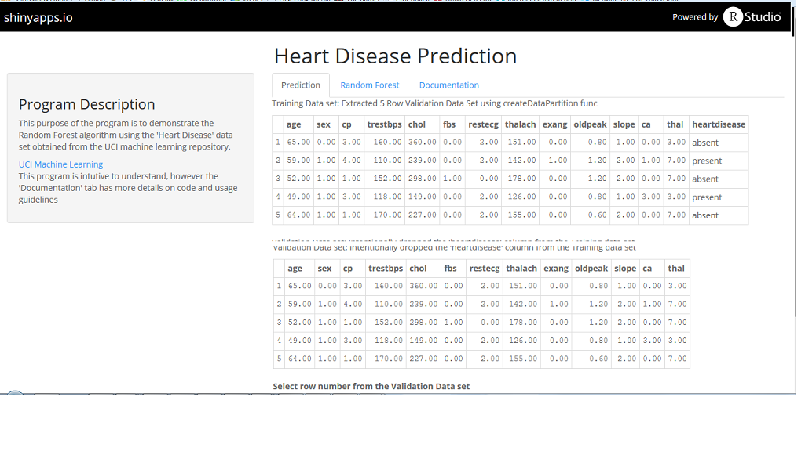
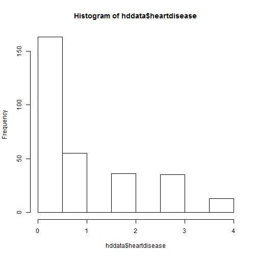

## Motivation

1. Learn more about the Random Forest Algorithm while doing the 'shiny' class project.
2. Use this idea to create a product whereby tuned Random Forest models for various data sets are preloaded, end users can then enter their own data too obtain predictions.

---

## Link To My Shiny Application

1. https://avosuser.shinyapps.io/HDPrediction/

---

## Screen Shot

---

## My Heart Disease Data Set

 
--- 

